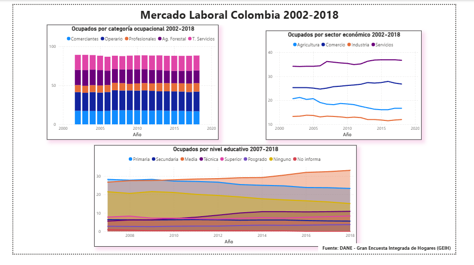

# 📊 Mercado Laboral Colombia 2002-2018

Análisis de la evolución del empleo en Colombia usando datos oficiales
del DANE, visualizado en un dashboard interactivo en Power BI.

---

## 🎯 Objetivo

Explorar el comportamiento del mercado laboral colombiano entre 2002 y 2018,
identificando tendencias en la distribución del empleo por sector económico,
categoría ocupacional y nivel educativo de los trabajadores.

---

## 📸 Vista previa del dashboard

---

### 🔎 Análisis y hallazgos

El dashboard sintetiza 16 años de evolución del mercado laboral colombiano
(2002-2018), construido a partir de microdatos de la Gran Encuesta Integrada
de Hogares (GEIH) del DANE. Los tres paneles responden preguntas estructurales
sobre el empleo en Colombia desde tres dimensiones complementarias.

---

#### 1️⃣ Distribución por sector económico

La economía colombiana muestra una estructura terciaria consolidada:
el sector **Servicios** concentra consistentemente la mayor proporción
de ocupados a lo largo de todo el período, seguido por **Comercio**.
Por su parte, **Agricultura** registra una tendencia decreciente sostenida,
pasando de representar más del 20% de los ocupados en 2002 a menos del 17%
en 2018, lo que refleja el proceso de urbanización y la recomposición
productiva del país durante ese período. La **Industria** se mantiene
relativamente estable, sin recuperar protagonismo como fuente de empleo formal.

---

#### 2️⃣ Categoría ocupacional

La distribución por categoría ocupacional revela una fuerza laboral
heterogénea. Los **trabajadores de servicios**, **comerciantes** y
**operarios no agrícolas** representan las categorías más numerosas,
consistente con el peso del sector terciario en la economía.
La baja participación de **profesionales y técnicos** a inicios del período
contrasta con su crecimiento gradual hacia 2018, sugiriendo una lenta pero
progresiva tecnificación del mercado laboral colombiano.

---

#### 3️⃣ Nivel educativo de los ocupados

Entre 2007 y 2018 se observa una transformación gradual en el perfil
educativo de la población ocupada. La proporción de trabajadores **sin ningún
nivel educativo** y con solo **primaria** disminuye consistentemente, mientras
que los niveles de **educación media**, **técnica** y **superior** ganan
participación. Este cambio refleja la expansión del sistema educativo
colombiano y el mayor acceso a la educación post-secundaria durante la década.

---

## 🗂️ Archivos del proyecto

| Archivo | Descripción |
|---|---|
| `mercado_laboral_colombia.pbix` | Dashboard en Power BI |
| `sectores_2002_2018.csv` | Ocupados por sector económico |
| `categorias_2002_2018.csv` | Ocupados por categoría ocupacional |
| `educacion_2007_2018.csv` | Ocupados por nivel educativo |
| `dashboard.png` | Captura del dashboard |

---

## 🛠️ Proceso

1. Descarga de datos oficiales del DANE
2. Conversión de archivos XLS a CSV
3. Limpieza y transformación en Power Query
4. Construcción del dashboard en Power BI Desktop

---

> 📊 **Nota metodológica:** Los datos corresponden a estimaciones
> expandidas con proyecciones de población elaboradas con base en
> los resultados del Censo 2005. Las cifras representan distribuciones
> porcentuales sobre el total de ocupados nacionales.

## 📌 Fuente de datos
DANE - Gran Encuesta Integrada de Hogares (GEIH)
🔗 https://www.dane.gov.co
